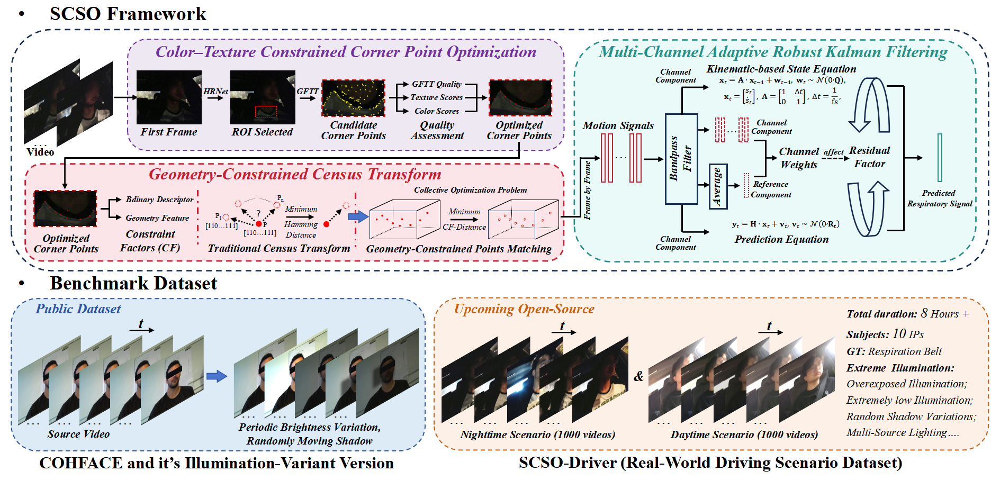

   <p align="center">
    <a href="https://scholar.google.com.hk/citations?user=1yhGS5sAAAAJ&hl=zh-CN"><strong>Gan Pei <sup>1</sup><sup>*</sup></strong></a>
    .
    <a href=""><strong>Junhao Ning<sup>1</sup></strong></a>
    .
    <a href="https://scholar.google.com.hk/citations?user=E6zbSYgAAAAJ&hl=zh-CN"><strong>Guangtao Zhai<sup>2</sup></strong></a>
    .
    <a href="https://scholar.google.com.hk/citations?user=yDEavdMAAAAJ&hl=zh-CN&oi=ao"><strong>Xiaokang Yang<sup>2</sup></strong></a>
    .
    <a href="https://scholar.google.com.hk/citations?user=8-Vo9cUAAAAJ&hl=zh-CN"><strong>Menghan Hu<sup>1</sup><sup>#</sup></strong></a>
</p>
<p align="center">
    <strong><sup>1</sup>East China Normal University</strong> &nbsp;&nbsp;&nbsp; <strong><sup>2</sup>Shanghai Jiao Tong University</strong>
   <p align="center">
   <strong>(Under Review)</strong>
   
### ✨Abstract
In video-based respiration estimation, extreme illumination variations, such as rapid global brightness fluctuations and random local shadows, severely degrade the reliability of signals extracted by existing algorithms, leading to significant performance degradation and hindering practical deployment in real-world environments. Moreover, the lack of real-world illumination-variant datasets further complicates research in this field. To address these challenges, we propose a motion-based video respiration estimation framework, SCSO, which integrates self-constrained and self-optimizing strategies through a color–texture constrained corner optimization module, a geometry-constrained Census Transform matching module, and an adaptive multi-channel Kalman filtering module to enable high-quality corner selection, illumination-robust matching, and reliable multi-source fusion, respectively. We construct a real-world driver respiration dataset, named SCSO-Driver, which covers both daytime and nighttime driving scenarios with a total duration exceeding 8 hours, for evaluating the algorithm’s illumination robustness. COHFACE and illumination-simulated COHFACE datasets are used to further extend the benchmark evaluation. Experimental results demonstrate that SCSO significantly outperforms existing state-of-the-art methods, achieving at least 40\% improvement in MAE under illumination variation scenarios.

### ✨Highlight
[1]   We propose a Color–Texture Constrained Corner Point Optimization module that optimizes respiration-related corner point selection across varying illumination intensities through quality assessment.

[2]   We propose a Geometry-Constrained Census Transform module that enhances corner matching robustness in extreme lighting variations through geometric structural constraints between inter-frame corner points.

[3]  We design a Multi-Channel Adaptive Robust Kalman Filtering module that performs self-optimized fusion of multi-source respiration signals, 

[4]  We construct the SCSO-Driver dataset, a real-world driver respiration dataset, filling a critical gap in extreme-illumination evaluation 


### ✨Pipeline
<p align="center">

 <p align="center">

### ✨SCSO-Driver Dataset
Dataset is recorded at 30 Hz with a resolution of \(960\times540\) pixels. Ground-truth respiration signals were obtained using a wireless piezoelectric respiration belt attached to the driver’s abdomen and sampled at 50 Hz. Both the video and belt signals were synchronously acquired and transmitted to a laptop placed on the passenger seat to ensure precise temporal alignment. The dataset includes 10 participants for both daytime and nighttime scenarios, with each participant providing 100 driving videos of 15 seconds per scenario. The RR ranges from 10 to 40 bpm. In the nighttime scenario, RR values span from 10 to 34 bpm (mean: 19.94 bpm, SD: 10.27 bpm), while in the daytime scenario, RR ranges from 10 to 40 bpm (mean: 20.31 bpm, SD: 14.57 bpm). In total, the dataset contains 2,000 driving samples, corresponding to over 8 hours of recordings. For dataset requests, please contact the author via email.

### Contact
```
52295904023@stu.ecnu.edu.cn
```
